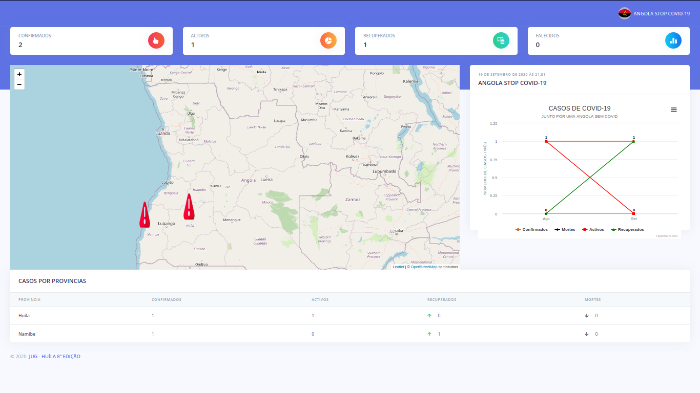

Para o rodar o projecto na sua maquina, siga as seguintes instruções:

1. Faça download ou clone do projecto
2. Instale todas as dependencias atraves do seguintes comando.
3. Dentro da pasta do projecto faça:
  pip install -r requirements.txt
  
  

     

  
